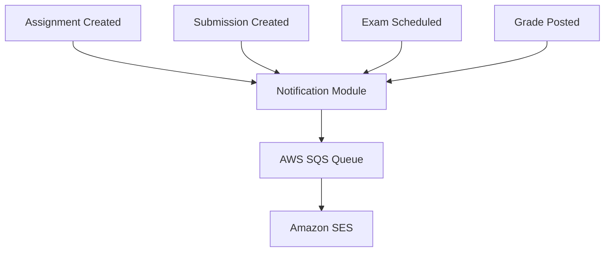

# Spring Modulith Implementation Plan - Shiksha LMS

## Executive Summary

This document outlines the detailed implementation plan for converting the Shiksha Learning Management System into a modular monolith using Spring Modulith architecture. The plan follows domain-driven design principles and implements event-driven communication between modules.

## Sequential Implementation Strategy

### Phase 1: Foundation & Core Setup (Week 1-2)

#### 1.1 Project Structure Setup
- **Current State**: Basic Spring Boot application with authentication module started
- **Target State**: Complete Spring Modulith package structure with clear module boundaries

**Package Structure:**
```
com.shiksha/
├── ShikshaLmsApplication.java (main app)
├── authentication/
│   ├── domain/        # User, UserRole, UserService, UserRepository
│   ├── security/      # SecurityConfig, JwtTokenProvider, JwtAuthenticationFilter
│   └── web/          # AuthController, DTOs
├── assignment/
│   ├── domain/        # Assignment, AssignmentService, AssignmentRepository
│   ├── events/        # AssignmentCreatedEvent, AssignmentUpdatedEvent
│   └── web/          # AssignmentController, DTOs
├── submission/
│   ├── domain/        # AssignmentSubmission, SubmissionService, SubmissionRepository
│   ├── events/        # SubmissionCreatedEvent, SubmissionUpdatedEvent
│   └── web/          # SubmissionController, DTOs
├── exam/
│   ├── domain/        # Exam, ExamService, ExamRepository
│   ├── events/        # ExamScheduledEvent, ExamUpdatedEvent
│   └── web/          # ExamController, DTOs
├── grade/
│   ├── domain/        # Grade, GradeService, GradeRepository
│   ├── events/        # GradePostedEvent, GradeUpdatedEvent
│   └── web/          # GradeController, DTOs
├── notification/
│   ├── domain/        # EmailNotification, NotificationService
│   ├── events/        # NotificationSentEvent
│   ├── listeners/     # Event listeners for all domain events
│   └── templates/     # Email templates
├── dashboard/
│   ├── domain/        # DashboardService, AnalyticsService
│   └── web/          # DashboardController, DTOs
└── shared/
    ├── events/        # Base event classes, event publishing infrastructure
    ├── exceptions/    # Global exception handling
    ├── config/        # Shared configuration
    └── utils/         # Common utilities
```

#### 1.2 Spring Modulith Configuration
- **Dependencies**: Ensure Spring Modulith starter and test dependencies are configured
- **Module Boundaries**: Use `package-info.java` to define module boundaries
- **Testing**: Enhance existing `ModularityTests.java` for comprehensive module verification

### Phase 2: Authentication Module Enhancement (Week 2-3)

#### 2.1 Complete Authentication Domain
- **Entities**: User, UserRole with proper JPA mappings
- **Repository**: UserRepository with custom queries for dashboard needs
- **Service**: UserService with role-based operations
- **Security**: JWT token provider with role-based claims

#### 2.2 User-Subject Enrollment
- **Entity**: UserSubject mapping table
- **Logic**: Enrollment management for teachers and students
- **Validation**: Grade level and subject consistency checks

#### 2.3 Authentication Events
- **UserRegisteredEvent**: Published when new user registers
- **UserLoginEvent**: Track login activities (optional for analytics)

### Phase 3: Assignment Module Implementation (Week 3-4)

#### 3.1 Assignment Domain Model
```java
// Core entities and business logic
Assignment entity with:
- Teacher reference (user_id)
- Subject and grade level
- File metadata (S3 key, original filename)
- Due dates and status
```

#### 3.2 File Management Integration
- **S3 Service**: Secure file upload and download
- **File Validation**: PDF-only validation with size limits
- **Presigned URLs**: Time-limited access for downloads

#### 3.3 Assignment Events
- **AssignmentCreatedEvent**: Triggers student notifications
- **AssignmentUpdatedEvent**: Notifies of changes
- **AssignmentDeletedEvent**: Cleanup and notifications

#### 3.4 Assignment REST API ✅ IMPLEMENTED
```java
POST /api/assignments     # Create assignment with file upload ✅
GET /api/assignments/{id} # Get specific assignment ✅
GET /api/assignments/{id}/download # Download assignment file ✅

// NEW ENDPOINTS IMPLEMENTED:
GET /api/assignments/student?gradeLevel={level}&subjectIds={ids} # Student view assignments ✅
GET /api/assignments/teacher?gradeLevel={level}&status={status} # Teacher view with filtering ✅

// FUTURE IMPLEMENTATION:
PUT /api/assignments/{id} # Update assignment details
DELETE /api/assignments/{id} # Soft delete assignment
```

**Recent Implementation Status:**
- ✅ **AssignmentController** with student and teacher endpoints
- ✅ **AssignmentService** with filtering by grade level and teacher
- ✅ **AssignmentRepository** with custom queries for teacher filtering
- ✅ **File Management** integrated with S3 service
- ✅ **Event Publishing** via AssignmentCreatedEvent

**Key Features Implemented:**
- Student assignments retrieval by grade level and subjects (from login data)
- Teacher assignments with filtering by grade level and status (active, inactive, overdue, upcoming)
- Authentication-based access control
- Sorted results by creation date
- Error handling and proper HTTP responses

### Phase 4: Submission Module Implementation (Week 4-5)

#### 4.1 Submission Domain Model
```java
AssignmentSubmission entity with:
- Assignment reference
- Student reference (user_id)
- File metadata (S3 key, original filename)
- Submission timestamp
- Status (SUBMITTED, REVIEWED, GRADED)
- Teacher feedback
```

#### 4.2 Submission Business Logic
- **Validation**: Ensure student can submit to assignment
- **File Management**: Separate S3 path structure for submissions
- **Status Tracking**: Submission lifecycle management

#### 4.3 Submission Events
- **SubmissionCreatedEvent**: Notifies teacher of new submission
- **SubmissionUpdatedEvent**: Status changes
- **SubmissionFeedbackAddedEvent**: Teacher adds feedback

#### 4.4 Submission REST API
```java
POST /api/submissions     # Submit assignment solution
GET /api/submissions      # List user's submissions
GET /api/assignments/{id}/submissions # Teacher view all submissions
PUT /api/submissions/{id}/feedback    # Teacher adds feedback
GET /api/submissions/{id}/download    # Download submission file
```

### Phase 5: Exam Module Implementation (Week 5-6)

#### 5.1 Exam Domain Model
```java
Exam entity with:
- Teacher reference
- Subject and grade level
- Exam details (date, time, duration)
- Topics and instructions
- Status tracking
```

#### 5.2 Exam Scheduling Logic
- **Date Validation**: Future dates only
- **Conflict Detection**: Prevent overlapping exams
- **Notification Triggers**: Auto-notify students

#### 5.3 Exam Events
- **ExamScheduledEvent**: New exam created
- **ExamUpdatedEvent**: Schedule changes
- **ExamCancelledEvent**: Exam removed

#### 5.4 Exam REST API
```java
POST /api/exams     # Schedule new exam
GET /api/exams      # List exams with filtering
GET /api/exams/{id} # Get exam details
PUT /api/exams/{id} # Update exam
DELETE /api/exams/{id} # Cancel exam
```

### Phase 6: Grade Module Implementation (Week 6-7)

#### 6.1 Grade Domain Model
```java
Grade entity with:
- Exam reference
- Student reference
- Score details (total, max score)
- Grading timestamp
- Graded by (teacher reference)
- Comments
```

#### 6.2 Grade Management Logic
- **Bulk Entry**: Support multiple student grades
- **Validation**: Score ranges and consistency
- **Analytics**: Performance calculations

#### 6.3 Grade Events
- **GradePostedEvent**: New grades entered
- **GradeUpdatedEvent**: Grade corrections
- **GradeSummaryEvent**: Batch grading completed

#### 6.4 Grade REST API
```java
POST /api/grades              # Enter grades for exam
GET /api/grades               # List grades with filtering
GET /api/exams/{id}/grades    # All grades for exam
PUT /api/grades/{id}          # Update specific grade
```

### Phase 7: Notification Module Implementation (Week 7-8)

#### 7.1 Notification Domain Model
```java
EmailNotification entity with:
- Recipient details
- Content and subject
- Notification type enum
- Related entity references
- Delivery status tracking
- Retry logic support
```

#### 7.2 Event Listeners Implementation
```java
@EventListener for:
- AssignmentCreatedEvent → Student notifications
- SubmissionCreatedEvent → Teacher notifications
- ExamScheduledEvent → Student exam alerts
- GradePostedEvent → Student grade notifications
```

#### 7.3 Email Template System
- **Template Engine**: Thymeleaf or similar
- **Template Categories**: Assignment, submission, exam, grade
- **Personalization**: Dynamic content injection

#### 7.4 SQS Integration
- **Queue Configuration**: AWS SQS for reliable delivery
- **Message Processing**: Async notification processing
- **Error Handling**: Dead letter queue for failed notifications

### Phase 8: Dashboard Module Implementation (Week 8-9)

#### 8.1 Teacher Dashboard Services
```java
// Grade-level student overview
TeacherDashboardService methods:
- getStudentsByGradeAndSubject()
- getStudentPerformanceSummary()
- getAssignmentSubmissionStats()
- getClassAnalytics()
```

#### 8.2 Student Dashboard Services
```java
// Subject-wise performance tracking
StudentDashboardService methods:
- getSubjectOverview()
- getAssignmentStatus()
- getGradeHistory()
- getUpcomingExams()
```

#### 8.3 Analytics Integration
- **Performance Views**: Database views for complex queries
- **Real-time Data**: Integration with other modules via events
- **Caching**: Strategic caching for frequently accessed data

#### 8.4 Dashboard REST APIs
```java
GET /api/dashboard/teacher/{gradeLevel}     # Teacher class overview
GET /api/dashboard/teacher/student/{id}     # Individual student details
GET /api/dashboard/student                  # Student main dashboard
GET /api/dashboard/student/subjects/{id}    # Subject-specific view
```

### Phase 9: Inter-Module Event System (Week 9-10)

#### 9.1 Event Infrastructure
```java
// Base event classes in shared package
@DomainEvent base class
EventPublisher utility
Event listener configuration
```

#### 9.2 Event Flow Mapping


#### 9.3 Async Processing
- **Spring @Async**: Enable asynchronous event processing
- **Thread Pools**: Configure appropriate thread pools
- **Error Handling**: Robust error handling for async operations

### Phase 10: Testing & Integration (Week 10-11)

#### 10.1 Module Testing Strategy
```java
// Comprehensive modularity tests
ModularityTests enhancements:
- verifyModuleDependencies()
- verifyEventPublishing()
- verifyModuleIsolation()
- generateModuleDocumentation()
```

#### 10.2 Integration Testing
- **Module Integration**: Test inter-module communication
- **Event Testing**: Verify event publishing and consumption
- **Database Testing**: Test with Testcontainers
- **File Upload Testing**: Test S3 integration

#### 10.3 End-to-End Testing
- **User Workflows**: Complete user journeys
- **Email Delivery**: Test notification system
- **File Operations**: Upload/download workflows
- **Performance Testing**: Load testing for scalability

## Module Communication Patterns

### Event-Driven Communication
```java
// Example event flow
1. Teacher creates assignment
2. Assignment module publishes AssignmentCreatedEvent
3. Notification module listens and processes
4. SQS message queued for email delivery
5. SES sends emails to enrolled students
6. Database updated with notification status
```

### API-Based Communication
```java
// Cross-module service calls
@Service
public class DashboardService {
    private final AssignmentService assignmentService;
    private final GradeService gradeService;
    
    // Aggregate data from multiple modules
    public StudentDashboard getStudentDashboard(Long studentId) {
        // Calls to other module services
    }
}
```

## Database Design Considerations

### Single Database Strategy
- **Logical Separation**: Tables grouped by module domain
- **Shared Tables**: Users and subjects accessed by multiple modules
- **Cross-References**: Foreign keys maintained across module boundaries
- **Views**: Database views for complex cross-module queries

### Migration Strategy
- **Flyway Integration**: Versioned database migrations
- **Module-Specific Migrations**: Separate migration files per module
- **Test Data**: Consistent test data across modules

## Security Implementation

### Module-Level Security
- **Authentication**: Centralized in authentication module
- **Authorization**: Role-based access control per module
- **File Security**: S3 integration with secure access patterns

### Cross-Module Security
- **Service Security**: Secure service-to-service communication
- **Event Security**: Secure event publishing with proper context
- **Data Access**: Ensure modules access only authorized data

## Performance Considerations

### Module Optimization
- **Lazy Loading**: Module components loaded on demand
- **Caching Strategy**: Module-specific caching where appropriate
- **Database Optimization**: Proper indexing for module queries

### Event Performance
- **Async Processing**: Non-blocking event processing
- **Batch Processing**: Efficient batch notifications
- **Queue Management**: Proper SQS configuration for performance

## Risk Mitigation

### Technical Risks
- **Module Dependencies**: Regular dependency analysis
- **Event Reliability**: Proper error handling and retry logic
- **Performance Bottlenecks**: Regular performance monitoring

### Implementation Risks
- **Phase Dependencies**: Clear phase boundaries and dependencies
- **Testing Coverage**: Comprehensive testing at each phase
- **Documentation**: Maintain up-to-date module documentation

## Success Criteria

### Technical Success
- ✅ All modules pass modularity verification tests
- ✅ Event-driven communication working end-to-end
- ✅ API contracts fulfilled as per TDD specifications
- ✅ File upload/download workflows operational
- ✅ Email notifications delivered reliably

### Business Success
- ✅ Teacher assignment workflow functional
- ✅ Student submission workflow operational
- ✅ Exam scheduling and grade entry working
- ✅ Dashboard analytics displaying correctly
- ✅ All user stories from PRD implemented

## Next Steps After Implementation

### Documentation
- API documentation generation
- Module interaction diagrams
- Deployment and maintenance guides

### Future Enhancements
- Module extraction to microservices (if needed)
- Additional notification channels
- Advanced analytics and reporting
- Mobile app integration preparation

---

*This implementation plan ensures a systematic, phase-by-phase approach to building a robust modular monolith that can evolve with the organization's needs while maintaining clean architecture principles.*