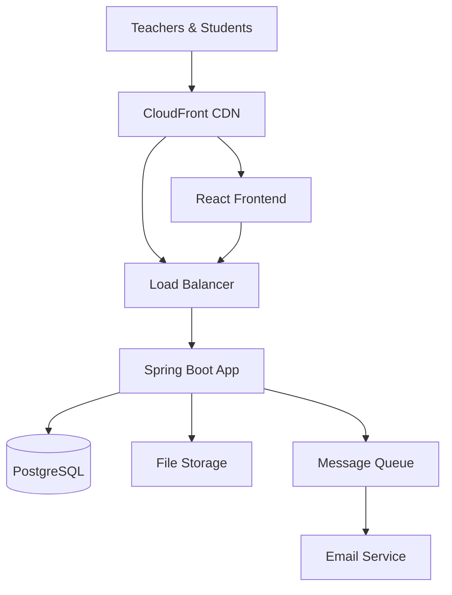
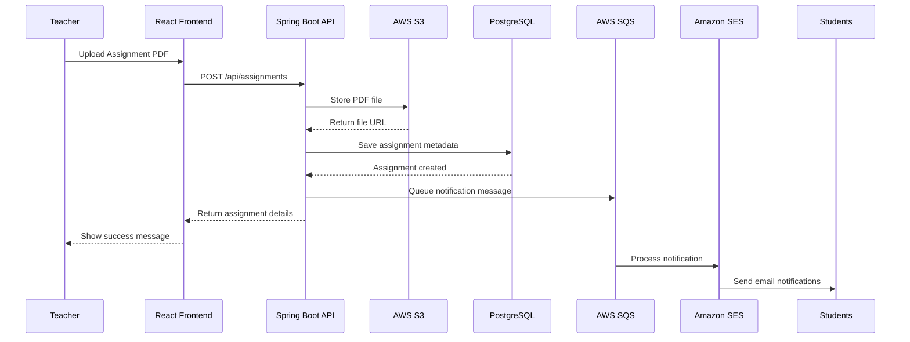
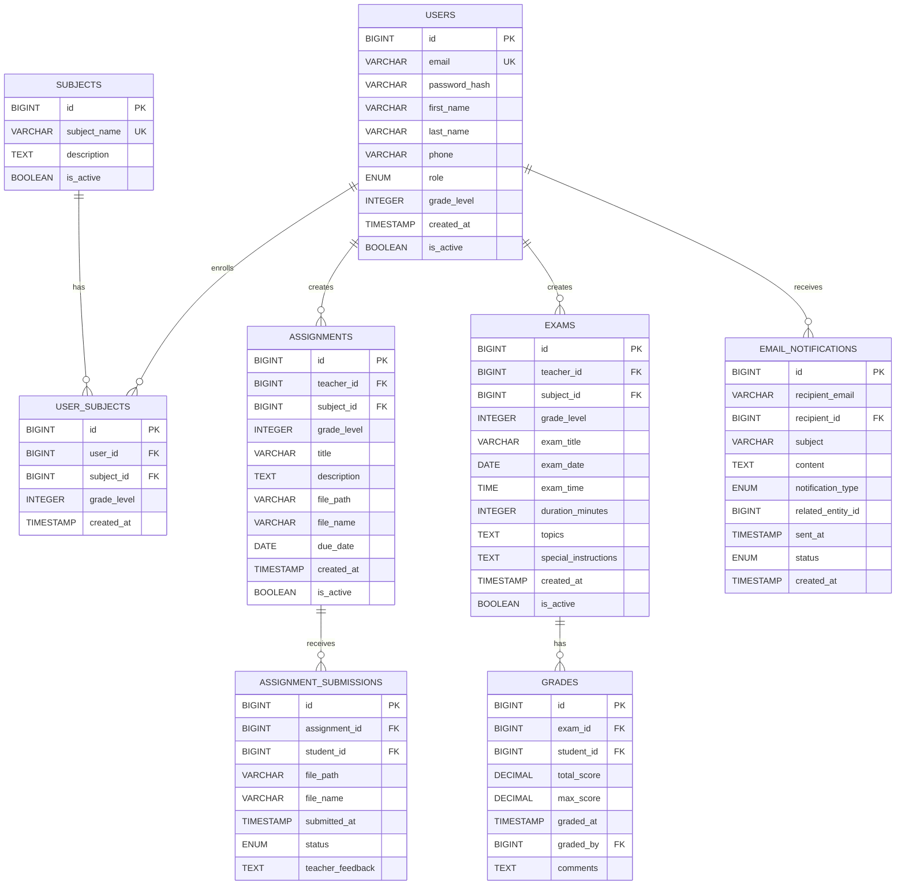
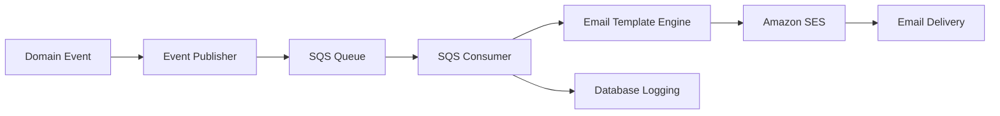

# Shiksha LMS - Technical Design Document

## Table of Contents
1. [Executive Summary](#executive-summary)
2. [System Architecture](#system-architecture)
3. [Complete API Specification](#complete-api-specification)
4. [Database Design](#database-design)
5. [Security Architecture](#security-architecture)
6. [Infrastructure Design](#infrastructure-design)
7. [File Management System](#file-management-system)
8. [Notification System](#notification-system)
9. [Frontend Architecture](#frontend-architecture)
10. [Performance & Scalability](#performance--scalability)
11. [Technology Stack](#technology-stack)
12. [Deployment Strategy](#deployment-strategy)
13. [Monitoring & Operations](#monitoring--operations)
14. [Risk Assessment](#risk-assessment)
15. [Future Enhancements](#future-enhancements)

---

## Executive Summary

**System Overview:** Cloud-native Learning Management System for Shiksha tuition center with Spring Boot backend, React frontend, and AWS infrastructure.

**Key Architecture Decisions:**
- **Backend:** Spring Boot 3.x with Spring Modulith (modular monolith)
- **Frontend:** React 18+ with TypeScript and Tailwind CSS
- **Database:** PostgreSQL on AWS RDS with performance optimization
- **File Storage:** AWS S3 with CloudFront CDN
- **Infrastructure:** Terraform-managed AWS infrastructure
- **Authentication:** JWT tokens with role-based authorization

**Business Value:** Streamlined digital workflow for assignment sharing, exam scheduling, and grade management across Math, Physics, and Chemistry subjects for grades 9-12.

---

## System Architecture

### High-Level Architecture


### Domain Modules (Spring Modulith)
- **Authentication Module:** User management, JWT, role-based access
- **Assignment Module:** Assignment CRUD, file management
- **Submission Module:** Student submissions, teacher reviews
- **Exam Module:** Exam scheduling, notifications
- **Grade Module:** Grade entry, performance analytics
- **Notification Module:** Email processing, template management

### Component Interaction Flow


---

## Complete API Specification

### Authentication Endpoints

#### POST /api/auth/register
**Purpose:** Register new user (teacher or student)

**Request Payload:**
```json
{
  "email": "john@example.com",
  "password": "SecurePass123!",
  "firstName": "John",
  "lastName": "Doe",
  "phone": "+91-9876543210",
  "role": "TEACHER",
  "gradeLevel": 10,
  "subjectIds": [1, 2]
}
```

**Response Payload:**
```json
{
  "status": "success",
  "message": "User registered successfully",
  "data": {
    "userId": 123,
    "email": "john@example.com",
    "firstName": "John",
    "lastName": "Doe",
    "role": "TEACHER",
    "subjects": [
      {"id": 1, "name": "Math"},
      {"id": 2, "name": "Physics"}
    ]
  }
}
```

#### POST /api/auth/login
**Purpose:** Authenticate user and receive JWT token

**Request Payload:**
```json
{
  "email": "john@example.com",
  "password": "SecurePass123!"
}
```

**Response Payload:**
```json
{
  "status": "success",
  "data": {
    "token": "eyJhbGciOiJIUzI1NiIs...",
    "refreshToken": "eyJhbGciOiJIUzI1NiIs...",
    "expiresIn": 86400,
    "user": {
      "id": 123,
      "email": "john@example.com",
      "firstName": "John",
      "lastName": "Doe",
      "role": "TEACHER",
      "subjects": [{"id": 1, "name": "Math"}]
    }
  }
}
```

#### GET /api/auth/profile
**Purpose:** Get current user profile information

**Response Payload:**
```json
{
  "status": "success",
  "data": {
    "id": 123,
    "email": "john@example.com",
    "firstName": "John",
    "lastName": "Doe",
    "phone": "+91-9876543210",
    "role": "TEACHER",
    "subjects": [{"id": 1, "name": "Math"}],
    "createdAt": "2025-01-15T10:30:00Z"
  }
}
```

#### PUT /api/auth/profile
**Purpose:** Update user profile information

#### PUT /api/auth/change-password
**Purpose:** Change user password

#### POST /api/auth/logout
**Purpose:** Invalidate user session

### Assignment Management Endpoints

#### POST /api/assignments
**Purpose:** Teacher uploads new assignment
**Content-Type:** multipart/form-data

**Request Payload (FormData):**
- title: "Quadratic Equations Practice"
- description: "Solve problems 1-15"
- subjectId: 1
- gradeLevel: 10
- dueDate: "2025-02-15"
- file: [PDF File]

**Response Payload:**
```json
{
  "status": "success",
  "message": "Assignment uploaded successfully",
  "data": {
    "id": 456,
    "title": "Quadratic Equations Practice",
    "description": "Solve problems 1-15",
    "subject": {"id": 1, "name": "Math"},
    "gradeLevel": 10,
    "fileName": "quadratic_equations.pdf",
    "fileSize": "2.3 MB",
    "dueDate": "2025-02-15",
    "createdAt": "2025-01-25T09:15:00Z",
    "teacher": {"id": 123, "name": "John Doe"}
  }
}
```

#### GET /api/assignments
**Purpose:** Get assignments list with filtering
**Query Parameters:** `subjectId`, `gradeLevel`, `status`, `page`, `size`, `sort`

**Response Payload:**
```json
{
  "status": "success",
  "data": {
    "assignments": [
      {
        "id": 456,
        "title": "Quadratic Equations Practice",
        "subject": {"id": 1, "name": "Math"},
        "gradeLevel": 10,
        "fileName": "quadratic_equations.pdf",
        "fileSize": "2.3 MB",
        "dueDate": "2025-02-15",
        "teacher": {"id": 123, "name": "John Doe"},
        "submissionCount": 12,
        "totalStudents": 15
      }
    ],
    "pagination": {
      "page": 0,
      "totalElements": 25,
      "totalPages": 3,
      "hasNext": true
    }
  }
}
```

#### GET /api/assignments/{id}
**Purpose:** Get specific assignment details

#### PUT /api/assignments/{id}
**Purpose:** Update assignment details

#### DELETE /api/assignments/{id}
**Purpose:** Delete/deactivate assignment

#### GET /api/assignments/{id}/download
**Purpose:** Download assignment PDF file

### Assignment Submission Endpoints

#### POST /api/submissions
**Purpose:** Student submits completed assignment
**Content-Type:** multipart/form-data

**Request Payload (FormData):**
- assignmentId: 456
- file: [PDF File]
- comments: "Completed all problems"

**Response Payload:**
```json
{
  "status": "success",
  "message": "Assignment submitted successfully",
  "data": {
    "id": 789,
    "assignmentId": 456,
    "assignmentTitle": "Quadratic Equations Practice",
    "fileName": "jane_submission.pdf",
    "fileSize": "1.8 MB",
    "submittedAt": "2025-02-10T16:30:00Z",
    "status": "SUBMITTED",
    "comments": "Completed all problems",
    "student": {"id": 234, "name": "Jane Smith"}
  }
}
```

#### GET /api/submissions
**Purpose:** Get user's submissions with filtering
**Query Parameters:** `assignmentId`, `studentId`, `status`, `page`, `size`, `sort`

#### GET /api/assignments/{assignmentId}/submissions
**Purpose:** Get all submissions for a specific assignment (teacher only)

**Response Payload:**
```json
{
  "status": "success",
  "data": {
    "assignmentTitle": "Quadratic Equations Practice",
    "dueDate": "2025-02-15",
    "submissions": [
      {
        "id": 789,
        "student": {"id": 234, "name": "Jane Smith", "email": "jane@example.com"},
        "fileName": "jane_submission.pdf",
        "submittedAt": "2025-02-10T16:30:00Z",
        "status": "SUBMITTED"
      }
    ],
    "submissionStats": {
      "totalStudents": 15,
      "submittedCount": 12,
      "pendingCount": 3,
      "submissionRate": "80%"
    }
  }
}
```

#### PUT /api/submissions/{id}/feedback
**Purpose:** Teacher adds feedback to submission

#### GET /api/submissions/{id}/download
**Purpose:** Download submission PDF file

### Exam Management Endpoints

#### POST /api/exams
**Purpose:** Teacher creates new exam

**Request Payload:**
```json
{
  "title": "Mid-Term Physics Exam",
  "subjectId": 2,
  "gradeLevel": 11,
  "examDate": "2025-03-15",
  "examTime": "10:00:00",
  "durationMinutes": 120,
  "topics": "Kinematics, Newton's Laws, Work and Energy",
  "specialInstructions": "Calculator allowed"
}
```

**Response Payload:**
```json
{
  "status": "success",
  "message": "Exam scheduled successfully",
  "data": {
    "id": 321,
    "title": "Mid-Term Physics Exam",
    "subject": {"id": 2, "name": "Physics"},
    "gradeLevel": 11,
    "examDate": "2025-03-15",
    "examTime": "10:00:00",
    "durationMinutes": 120,
    "topics": "Kinematics, Newton's Laws, Work and Energy",
    "specialInstructions": "Calculator allowed",
    "teacher": {"id": 123, "name": "John Doe"}
  }
}
```

#### GET /api/exams
**Purpose:** Get exams list with filtering
**Query Parameters:** `subjectId`, `gradeLevel`, `upcoming`, `page`, `size`

#### GET /api/exams/{id}
**Purpose:** Get specific exam details

#### PUT /api/exams/{id}
**Purpose:** Update exam details

#### DELETE /api/exams/{id}
**Purpose:** Cancel/delete exam

### Grade Management Endpoints

#### POST /api/grades
**Purpose:** Teacher enters grades for an exam

**Request Payload:**
```json
{
  "examId": 321,
  "grades": [
    {
      "studentId": 234,
      "totalScore": 85.5,
      "maxScore": 100.0,
      "comments": "Good understanding of concepts"
    },
    {
      "studentId": 235,
      "totalScore": 92.0,
      "maxScore": 100.0,
      "comments": "Excellent work!"
    }
  ]
}
```

**Response Payload:**
```json
{
  "status": "success",
  "message": "Grades entered successfully",
  "data": {
    "examTitle": "Mid-Term Physics Exam",
    "gradesEntered": 2,
    "averageScore": 88.75,
    "emailNotificationsSent": 2
  }
}
```

#### GET /api/grades
**Purpose:** Get grades with filtering

#### GET /api/exams/{examId}/grades
**Purpose:** Get all grades for specific exam (teacher only)

**Response Payload:**
```json
{
  "status": "success",
  "data": {
    "exam": {
      "id": 321,
      "title": "Mid-Term Physics Exam",
      "examDate": "2025-03-15",
      "subject": {"id": 2, "name": "Physics"}
    },
    "grades": [
      {
        "student": {"id": 234, "name": "Jane Smith"},
        "totalScore": 85.5,
        "percentage": 85.5,
        "comments": "Good understanding"
      }
    ],
    "statistics": {
      "totalStudents": 18,
      "gradedCount": 15,
      "averageScore": 78.2,
      "highestScore": 96.0,
      "lowestScore": 52.0
    }
  }
}
```

### Dashboard Endpoints

#### GET /api/dashboard/teacher/{gradeLevel}?subjectId={subjectId}
**Purpose:** Teacher dashboard - students overview for grade/subject

**Response Payload:**
```json
{
  "status": "success",
  "data": {
    "gradeLevel": 10,
    "subject": {"id": 1, "name": "Math"},
    "students": [
      {
        "id": 234,
        "name": "Jane Smith",
        "email": "jane@example.com",
        "assignmentStats": {
          "totalAssignments": 8,
          "submittedAssignments": 7,
          "submissionRate": "87.5%",
          "pendingAssignments": 1
        },
        "gradeStats": {
          "averageScore": 78.5,
          "examCount": 3,
          "trend": "improving"
        },
        "lastActivity": "2025-02-20T10:15:00Z"
      }
    ],
    "classStatistics": {
      "totalStudents": 15,
      "averageSubmissionRate": "84.2%",
      "averageClassScore": 76.8,
      "upcomingExams": 2
    }
  }
}
```

#### GET /api/dashboard/teacher/student/{studentId}
**Purpose:** Detailed student performance across all subjects

#### GET /api/dashboard/student
**Purpose:** Student main dashboard with subject tabs

**Response Payload:**
```json
{
  "status": "success",
  "data": {
    "student": {
      "id": 234,
      "name": "Jane Smith",
      "gradeLevel": 10,
      "enrolledSubjects": [
        {"id": 1, "name": "Math"},
        {"id": 2, "name": "Physics"},
        {"id": 3, "name": "Chemistry"}
      ]
    },
    "subjectOverview": [
      {
        "subject": {"id": 1, "name": "Math"},
        "assignmentStats": {
          "pendingCount": 2,
          "completedCount": 6,
          "nextDueDate": "2025-02-25"
        },
        "gradeStats": {
          "averageScore": 78.5,
          "examCount": 3,
          "trend": "improving"
        },
        "upcomingExams": [
          {
            "id": 321,
            "title": "Mid-Term Math Exam",
            "date": "2025-03-10",
            "topics": "Algebra, Trigonometry"
          }
        ]
      }
    ],
    "quickStats": {
      "totalPendingAssignments": 4,
      "upcomingExamsCount": 2,
      "overallAverage": 81.2
    }
  }
}
```

#### GET /api/dashboard/student/subjects/{subjectId}
**Purpose:** Detailed subject-specific student dashboard

### Supporting Endpoints

#### GET /api/subjects
**Purpose:** Get all available subjects

#### GET /api/notifications
**Purpose:** Get user's notification history

#### PUT /api/notifications/{id}/mark-read
**Purpose:** Mark notification as read

### API Error Response Format

**Standardized Error Structure:**
```json
{
  "status": "error",
  "message": "Detailed error message",
  "errorCode": "VALIDATION_ERROR",
  "errors": [
    {
      "field": "email",
      "message": "Email is already registered"
    }
  ],
  "timestamp": "2025-02-25T10:30:00Z"
}
```

**Common Error Codes:**
- `VALIDATION_ERROR`: Request validation failed
- `AUTHENTICATION_REQUIRED`: User not authenticated
- `AUTHORIZATION_DENIED`: User lacks permission
- `RESOURCE_NOT_FOUND`: Requested resource doesn't exist
- `FILE_UPLOAD_ERROR`: File upload failed
- `EMAIL_DELIVERY_ERROR`: Email notification failed

---

## Database Design

### Entity Relationship Model


### Database Schema Overview

**Core Tables:**
- **users:** User accounts with role-based access (teachers/students)
- **subjects:** Available subjects (Math, Physics, Chemistry)
- **user_subjects:** Enrollment mapping between users and subjects
- **assignments:** Teacher-created assignments with file references
- **assignment_submissions:** Student-submitted assignment solutions
- **exams:** Scheduled examinations with details
- **grades:** Exam results and performance tracking
- **email_notifications:** Notification delivery tracking

**Key Design Decisions:**
- **Role-based design:** Single users table with role differentiation
- **Flexible enrollment:** Many-to-many relationship for subject enrollment
- **File references:** Store S3 keys rather than direct file content
- **Audit trails:** Comprehensive timestamp and status tracking
- **Performance optimization:** Strategic indexing for common queries

### Performance Optimization Strategy

**Database Indexing:**
- **Primary performance indexes** on frequently queried columns
- **Composite indexes** for complex query patterns
- **Partial indexes** for filtered queries (active records only)
- **Foreign key indexes** for efficient joins

**Query Optimization:**
- **Database views** for complex dashboard queries
- **Materialized views** for heavy analytical queries (future enhancement)
- **Connection pooling** with optimized pool sizes
- **Query plan monitoring** and optimization

---

## Security Architecture

### Authentication & Authorization

**JWT Token Structure:**
- **Payload:** userId, email, role, subjects, permissions
- **Expiration:** 24 hours for access token, 7 days for refresh token
- **Algorithm:** HS512 for development, RS256 for production
- **Storage:** HTTP-only cookies for web, secure storage for mobile

**Role-Based Access Control:**

| Resource | Teacher | Student |
|----------|---------|---------|
| Create Assignment | ✅ Own Subject | ❌ |
| View Assignment | ✅ All | ✅ Own Grade/Subject |
| Submit Assignment | ❌ | ✅ Own Assignments |
| Schedule Exam | ✅ Own Subject | ❌ |
| Enter Grades | ✅ Own Exams | ❌ |
| View Student Performance | ✅ Own Students | ❌ |
| View Own Grades | ❌ | ✅ Own Only |

### File Security Architecture

**Upload Security:**
- **File Type Validation:** PDF only, MIME type and file signature verification
- **File Size Limits:** 10MB maximum per file
- **Malware Scanning:** Integration capability for virus detection
- **Secure Naming:** UUID-based filenames to prevent path traversal

**Access Control:**
- **S3 Bucket Policies:** No public access, signed URLs for downloads
- **Time-Limited Access:** Presigned URLs with 24-hour expiration
- **Audit Trail:** All file access logged with user context
- **Cross-Reference Validation:** Ensure users can only access authorized files

### Data Protection

**Encryption Strategy:**
- **Data at Rest:** S3 server-side encryption, RDS encryption
- **Data in Transit:** TLS 1.3 for all communications
- **Password Security:** BCrypt hashing with salt rounds
- **Sensitive Data:** AWS KMS integration for additional encryption layers

**Security Monitoring:**
- **Authentication Monitoring:** Failed login attempts, suspicious patterns
- **Authorization Auditing:** Access denied events, permission escalations
- **File Access Tracking:** Complete audit trail for file operations
- **Security Event Correlation:** Automated analysis of security patterns

---

## Infrastructure Design

### AWS Infrastructure Overview

**Core AWS Services:**
- **Compute:** EC2 instances with Auto Scaling Groups
- **Load Balancing:** Application Load Balancer with health checks
- **Database:** RDS PostgreSQL with automated backups
- **Storage:** S3 for file storage and frontend hosting
- **CDN:** CloudFront for global content delivery
- **Messaging:** SQS for notification queuing
- **Email:** SES for automated email notifications
- **DNS:** Route 53 for domain management

### Network Architecture

**VPC Design:**
- **Isolated Network:** Dedicated VPC with public and private subnets
- **Multi-AZ Deployment:** High availability across availability zones
- **NAT Gateways:** Secure outbound internet access for private resources
- **Security Groups:** Network-level access control and firewall rules

**Subnet Strategy:**
- **Public Subnets:** Load balancer and NAT gateway placement
- **Private Subnets:** Application servers and database instances
- **Database Subnets:** Isolated database subnet group for RDS

### Infrastructure as Code

**Terraform Organization:**
- **Modular Structure:** Separate modules for networking, compute, storage
- **Environment Separation:** Dev, staging, and production configurations
- **State Management:** Remote state storage with locking mechanism
- **Resource Tagging:** Comprehensive tagging for cost allocation and management

**Deployment Environments:**
- **Development:** Cost-optimized with minimal resources
- **Staging:** Production-like for testing and validation
- **Production:** High availability with enhanced monitoring

---

## File Management System

### AWS S3 Integration Strategy

**S3 Bucket Organization:**
```
File Storage Bucket Structure:
├── assignments/
│   ├── math/grade9/, math/grade10/, math/grade11/, math/grade12/
│   ├── physics/grade9/, physics/grade10/, physics/grade11/, physics/grade12/
│   └── chemistry/grade9/, chemistry/grade10/, chemistry/grade11/, chemistry/grade12/
└── submissions/
    ├── math/, physics/, chemistry/
    └── Organized by subject and student
```

### File Processing Workflow

**File Upload Process:**
1. **Frontend Validation:** File type, size, and format validation
2. **Backend Validation:** Secondary validation with file signature checking
3. **S3 Upload:** Direct upload with metadata tagging and security policies
4. **Database Recording:** Store file metadata and S3 object key
5. **Notification Trigger:** Async event publishing for email notifications

**File Download Process:**
1. **Authorization Check:** Verify user permissions for file access
2. **Presigned URL Generation:** Create time-limited S3 access URL
3. **Audit Logging:** Record file access for security monitoring
4. **Redirect Response:** HTTP 302 redirect to presigned URL

### File Security Controls

**Access Control Strategy:**
- **IAM Policies:** Restrict S3 access to authorized application components only
- **Bucket Policies:** No public read access, private bucket configuration
- **Presigned URLs:** Time-limited access (24-hour expiration) for downloads
- **File Validation:** Multi-layer validation including MIME type verification

**File Metadata Management:**
- **Database References:** Store S3 object keys, not direct URLs
- **Metadata Storage:** File size, upload timestamp, original filename
- **Version Control:** S3 versioning enabled for assignment updates
- **Cleanup Policies:** Automated deletion of orphaned files and old versions

---

## Notification System

### Event-Driven Architecture

**Notification Flow:**


**Event Types:**
- **AssignmentCreatedEvent:** New assignment posted by teacher
- **SubmissionCreatedEvent:** Student submits assignment
- **ExamScheduledEvent:** New exam scheduled
- **GradePostedEvent:** Exam grades entered by teacher

### Email Notification System

**Template Categories:**
- **Assignment Notifications:** New assignment alerts to students
- **Submission Notifications:** Assignment submission alerts to teachers
- **Exam Notifications:** Exam scheduling alerts to students
- **Grade Notifications:** Grade posting alerts to students

**Template Variables:**
- **Personalization:** Student/teacher names, subject information
- **Context Data:** Assignment titles, exam dates, grade scores
- **Action Links:** Direct links to relevant dashboard sections
- **Branding:** Consistent branding and styling

### Reliability and Fault Tolerance

**Message Processing:**
- **SQS Integration:** Reliable message queuing with delivery guarantees
- **Dead Letter Queue:** Failed messages for manual review and reprocessing
- **Retry Logic:** Automatic retry for transient failures (maximum 3 attempts)
- **Delivery Tracking:** Database logging of notification status and delivery confirmation

**Performance Optimization:**
- **Async Processing:** Non-blocking notification processing
- **Batch Processing:** Efficient handling of bulk notifications
- **Rate Limiting:** Respect SES sending limits and quotas
- **Error Handling:** Graceful degradation for notification failures

---

## Frontend Architecture

### React Application Structure

**Component Architecture:**
```
Frontend Organization:
├── components/common/     # Reusable UI components, layout, forms
├── components/auth/       # Authentication and user management
├── components/dashboard/  # Teacher and student dashboards
├── components/assignments/# Assignment management interfaces
├── components/exams/      # Exam scheduling and viewing
├── components/grades/     # Grade management and display
├── hooks/                 # Custom React hooks for business logic
├── services/             # API service layer and HTTP client
├── stores/               # State management (Context API, React Query)
├── types/                # TypeScript type definitions
└── utils/                # Helper functions and utilities
```

### State Management Strategy

**State Management Approach:**
- **Server State:** React Query for API data caching and synchronization
- **Client State:** React Context API for global application state
- **Form State:** React Hook Form for form management and validation
- **UI State:** Local component state using useState and useReducer

**Data Flow Design:**
- **API Integration:** Centralized service layer with Axios interceptors
- **Error Handling:** Global error boundary and user-friendly error messages
- **Loading States:** Consistent loading indicators and skeleton screens
- **Optimistic Updates:** Immediate UI feedback with server synchronization

### User Experience Design

**Responsive Design:**
- **Mobile-First:** Optimized for mobile devices and tablets
- **Progressive Enhancement:** Enhanced features for larger screens
- **Touch-Friendly:** Appropriate touch targets and gesture support
- **Accessibility:** WCAG compliance and screen reader support

**Performance Optimization:**
- **Code Splitting:** Route-based lazy loading for reduced bundle size
- **Component Memoization:** React.memo and useMemo for expensive operations
- **Image Optimization:** Responsive images with appropriate formats
- **Bundle Analysis:** Regular analysis for size optimization

---

## Performance & Scalability

### Performance Targets

**System Performance Requirements:**
- **API Response Time:** 95th percentile under 500ms
- **Database Queries:** Complex queries under 100ms
- **File Upload Speed:** 10MB files upload in under 30 seconds
- **Page Load Time:** Initial page load under 3 seconds
- **System Availability:** 99.9% uptime SLA target

### Database Performance Strategy

**Query Optimization:**
- **Strategic Indexing:** Composite indexes for frequently used query patterns
- **Database Views:** Pre-computed views for complex dashboard queries
- **Connection Pooling:** HikariCP with optimized pool settings
- **Query Monitoring:** Regular performance analysis and optimization

**Caching Strategy:**
- **Application Caching:** Spring Cache for frequently accessed data
- **Database Caching:** PostgreSQL query plan caching and buffer optimization
- **CDN Caching:** CloudFront for static assets and API response caching
- **Browser Caching:** Appropriate cache headers for static resources

### Scalability Architecture

**Horizontal Scaling:**
- **Auto Scaling Groups:** CPU and memory-based scaling policies
- **Load Balancing:** Application Load Balancer with health checks
- **Database Scaling:** Read replicas for read-heavy operations
